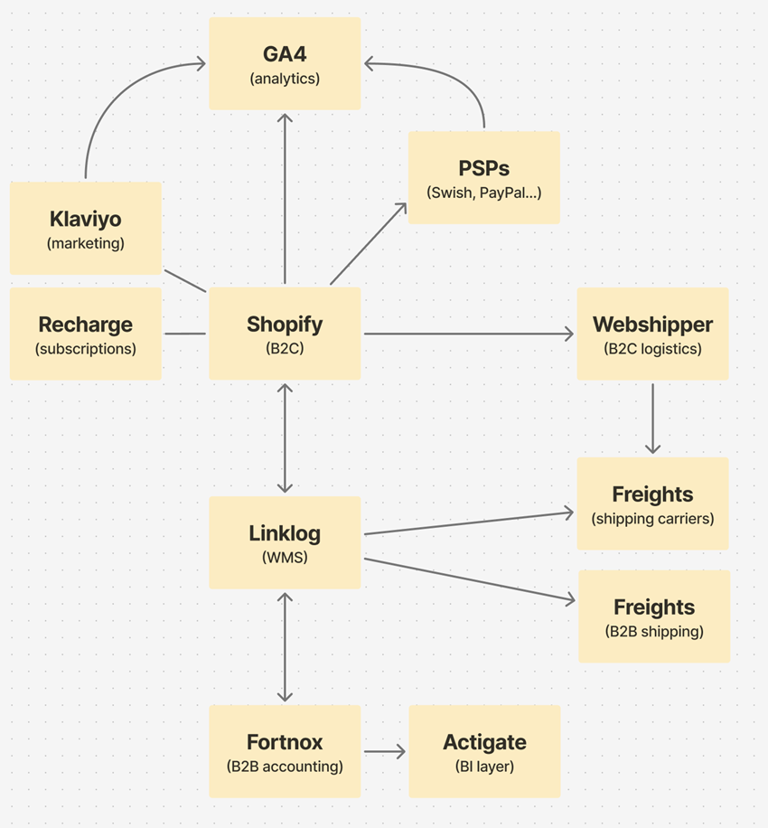

# Lykke-Kaffegårdar
Lykke Kaffegårdar technical data pipeline demonstration


## 1. Executive Summary
Lykke Kaffegårdar is Sweden’s fastest-growing sustainable coffee project, now expanding across multiple European markets. As the company prepares to scale its e-commerce from ~2M SEK annually to a tenfold increase, it faces a key challenge: ensuring consistent, reliable data insights across partners and markets. Fragmented reporting and limited visibility into customer behavior, product performance, and partner operations currently hinder decision-making and revenue growth.

This report outlines how Lykke can address these challenges by adopting a lightweight but scalable analytics approach. Instead of investing in a full-scale data warehouse at this stage, we recommend beginning with a Business Intelligence (BI) solution such as Power BI. This allows Lykke to connect existing systems (Shopify, Fortnox, GA4, PSPs, and logistics platforms), define and track core KPIs, and build clear, actionable dashboards for decision-makers.

Our proposed approach balances immediate needs—simple, reliable insights to guide growth—with long-term scalability. By establishing unified KPI tracking, identifying high-potential markets and customer segments, and creating a foundation for data-informed decisions, Lykke can drive sustainable revenue growth while maintaining its mission: *to save the future of coffee and coffee farmers.*


## 2. Current Situation & Challenges

### 2.1 Current Systems Overview
Lykke currently operates its e-commerce and business processes through a combination of specialized systems that each serve a distinct function. These systems are connected in varying degrees, and together they support sales, logistics, finance, and marketing operations.

- **Shopify**: Central e-commerce platform for online sales, products, and customers.

- **Recharge** (Shopify plugin): Manages subscriptions, integrated with Shopify orders.

- **Payment Service Providers** (Stripe, Klarna, PayPal, etc.): Process customer payments, fees, and refunds.

- **Fortnox** (B2B): ERP/accounting system for wholesale operations (invoices, customer accounts). Data flows into Actigate for reporting.

- **Actigate**: Business intelligence and integration layer, pulling data from Fortnox and providing consolidated financial/operational insights.

- **Webshipper** (B2C): Shipping automation system for consumer orders. Connects Shopify to freight carriers for fulfillment and tracking.

- **Freights** (PostNord, DHL): Shipping carriers that deliver orders to customers, receiving instructions from Webshipper.

- **Linklog** (WMS): Warehouse Management System (if still used alongside Webshipper, likely for stock/returns).

- **GA4** (Google Analytics): Tracks marketing performance, customer traffic, and site behavior.

- **Klaviyo** (Shopify app): Marketing automation tool for email/SMS, customer segmentation, and campaign performance.


In practice, these systems work together as follows: Shopify acts as the central hub, connecting to subscription services (Recharge), payment processing (PSPs), logistics (Linklog and Freights), finance (Fortnox), and analytics (GA4). Currently, insights are often accessed through the individual dashboards of each tool or via manual exports.  



At present, the complexity is further increased by the fact that each local partner operates its own webshop rather than sharing a single platform. This means that while the systems in use are largely the same across markets, they are managed separately. Data is therefore generated and stored in parallel silos, with variations in processes and reporting between partners. As Lykke expands, this decentralized structure will make it harder to gain a consistent overview of operations and customer behavior across markets.  

---

### 2.2 Challenges  
The current setup presents several challenges for Lykke’s growth ambitions:  

- **Fragmented data**: Information is spread across Shopify, Recharge, PSPs, Linklog, Fortnox, GA4, and local partner systems. Without integration, analysis requires manual consolidation, which is time-consuming and error-prone.  
- **Lack of unified KPIs across markets**: Each system provides metrics, but they are not standardized or easily comparable across geographies and partners. This makes it difficult to answer strategic questions such as which products, markets, or customer segments drive the most value.  
- **Limited visibility for decision-making**: Because insights are siloed within individual tools, management lacks a holistic view of performance. This hampers the ability to identify growth levers, monitor efficiency, and proactively address issues as the business scales.  

*Together, these challenges highlight the need for a more unified and scalable analytics approach, one that enables Lykke to consistently track performance and make data-informed decisions across all markets.*


## 3. Business Needs
To accelerate its B2C e-commerce growth, Lykke requires a clear framework for **core KPI tracking**. Four metrics stand out as the most strategic for monitoring business performance:

- **Acquisition / Growth:** *New Customers per Month* — measures expansion of the customer base.  
- **Retention / Loyalty:** *Customer Retention Rate (CRR)* — signals the ability to build lasting relationships and repeat purchases.  
- **Profitability (Sustainability):** *CLV/CAC Ratio* — ensures that the value of customers outweighs acquisition costs.  
- **Profitability (Unit Economics):** *Contribution Margin (%)* — shows whether each sale contributes positively after product, marketing, and variable costs.  

Alongside these core KPIs, Lykke will also benefit from supporting metrics (e.g. Average Order Value, Conversion Rate, Purchase Frequency, Gross Margin, NPS) which serve as diagnostic levers. These are not core because they do not, on their own, capture business success; instead, they help explain *why* core KPIs improve or decline.  

In addition, Lykke needs to identify its **growth levers**:
- **Markets**: which geographies show highest potential for profitable expansion.  
- **Products**: which SKUs drive retention, higher AOV, and loyalty.  
- **Customers**: which segments deliver the highest CLV, and which can be reactivated or nurtured.  

Finally, success will depend on building simple but reliable dashboards that translate these KPIs into clear insights for ongoing decision-making. These dashboards should enable management to monitor overall performance at a glance, while also allowing segmentation by market and partner.  

Since Lykke will operate one central e-commerce site but handle fulfillment locally through partners, dashboards must show both global totals and partner-level breakdowns. This ensures that growth in one market does not hide underperformance in another, and that commission-based payouts remain fair and transparent.  

The recommended setup is therefore:  
- **Executive Dashboard**: One main view anchored on the four core KPIs (New Customers, CRR, CLV/CAC, Contribution Margin), with global totals at the top and partner/market comparisons beneath.  
- **Supporting Dashboards**: Objective-specific panels (Acquisition, Retention, Profitability, Customer Segmentation) that provide diagnostic detail and can be filtered by market.  

This approach gives Lykke a scalable and transparent system: one website, one dashboard structure, but insights that serve both global decision-making and local partner accountability.


## 4. Recommended Analytics Approach  

### 4.1 Evaluation of Strategic Options  

#### Enterprise Data Warehouse (Snowflake/dbt, etc.)
An enterprise data warehouse is a centralized platform designed to store, transform, and integrate very large and complex datasets from multiple systems. Tools like Snowflake and dbt enable companies to build robust pipelines, apply advanced transformations, and scale analytics as data volumes grow.  

- **Benefits**:  
  - Provides a single source of truth by consolidating all systems into one structured environment.  
  - Enables advanced analytics, machine learning, and automation.  
  - Strong governance and data quality management.  

- **Limitations for Lykke**:  
  - High upfront cost and technical overhead, requiring dedicated data engineering resources.  
  - Longer implementation timeline before insights are available.  
  - Would add more complexity than value for Lykke’s setup: even as the company scales across more markets, the overall data volume will remain relatively small (sales, products, partners). The challenge is **data consistency across markets**, not “big data.”  
  - In practice, an enterprise warehouse would add complexity and costs without creating proportional value for Lykke.  

---  

#### Lightweight Business Intelligence tool (Power BI, Looker Studio)
A lightweight BI approach connects directly to existing data sources (e.g., Shopify, Fortnox, GA4) without building a full warehouse. Power BI allows the creation of interactive dashboards, applying basic transformations and modeling within the tool itself.  

- **Pros**:  
  - Faster to implement and more cost-effective compared to a full data warehouse.  
  - Allows teams to start tracking KPIs and visualizing data quickly.  
  - Direct connectors for most of Lykke’s current systems reduce the need for heavy engineering.  
  - Flexible and user-friendly for non-technical users, supporting self-service reporting.  

- **Cons**:  
  - Data remains fragmented unless connectors and models are carefully maintained.  
  - Limited history and depth of analysis compared to a warehouse.  
  - Scalability challenges: as Lykke grows and adds markets, dashboards will require oversight to ensure accuracy and consistency.  

---

### 4.2 Most Suitable Approach for Lykke
Given Lykke’s current stage and business model, Power BI is the most suitable solution to meet their analytics needs.

Lykke’s main challenge is not handling massive volumes of data, but rather ensuring data consistency across markets, partners, and systems. A lightweight BI tool like Power BI addresses this challenge in a pragmatic way:

- **Right-sized for Lykke’s data**: Even as Lykke expands to more markets, the underlying datasets (sales, products, customers, partners) remain relatively small compared to companies that require a full enterprise warehouse.

- **Quick time-to-value**: Power BI can be implemented rapidly, enabling Lykke to begin monitoring KPIs, customer segments, and partner performance without the delays of building a complex data infrastructure.

- **Supports growth and scale**: While simpler than a data warehouse, Power BI still offers the flexibility to connect to multiple systems (Shopify, Fortnox, GA4, etc.), manage data models, and expand dashboards as new markets come online.

- **Practical governance**: Data consistency rules and oversight can be embedded into Power BI models, giving Lykke the reliability it needs without heavy engineering.

Power BI provides a scalable, cost-effective, and user-friendly approach that matches Lykke’s mission and growth ambitions. It balances today’s need for reliable, consistent data with the flexibility to grow as the business expands across Europe.

---

## 5. Power BI Implementation Considerations
### 5.1 How Power BI Works for Lykke
Power BI will serve as the central platform for unifying Lykke’s fragmented data sources into one place. By connecting directly or via exports/APIs, it allows the team to monitor sales, customers, marketing, logistics, and finance in a consolidated view. Below is an overview of how each source connects and what type of insights it brings:

**E-commerce & Customer Data**
- **Shopify**: Connects directly to Power BI through a native connector or via scheduled CSV/API exports. Provides key data on orders, customers, products, and revenue.
- **Recharge** (subscriptions): Data is stored within Shopify orders but can also be accessed through Recharge’s API. Enables subscription-specific analysis, such as recurring revenue and churn.

**Payments & Finance**
- **Payment Service Providers**: Transaction data can be imported via CSV exports or API connectors into Power BI. This makes it possible to track payment volumes, fees, and refund rates.
- **Fortnox** (ERP for B2B): Finance and wholesale data can be accessed in two ways. 
One is to connect direct to Power BI: possible via Fortnox API or third-party connectors, but requires ongoing setup and maintenance. The other option is via Actigate: already structures and consolidates Fortnox data into business-ready reports, reducing complexity.
For Lykke, using Actigate as the middle layer is more practical, as it minimizes technical overhead while ensuring financial data is consistent and reliable.

**Logistics & Fulfilment**
- **Webshipper** (B2C shipping automation): Connects to Power BI through API or exports. Provides data on shipping lead times, carrier performance, and fulfillment efficiency.
- **Freights** (PostNord, DHL): Shipment details are consolidated in Webshipper, so Power BI consumes these metrics indirectly.
- **Linklog** (WMS): If still in use, stock and returns data can be added to Power BI through CSV exports or API feeds.

**Marketing & Traffic**
- **Google Analytics 4** (GA4): Connects via a native Power BI connector or through BigQuery/CSV exports. Brings in website traffic, conversion funnels, and acquisition insights.
- **Klaviyo** (email/SMS automation): Data can be connected via API or exports into Power BI. This enables analysis of campaign performance, customer segmentation, and re-engagement metrics.


#### *The role of Actigate
Actigate plays a valuable role by simplifying access to Fortnox and potentially other systems. Instead of Power BI having to pull raw, unstructured accounting data from Fortnox, Actigate prepares and delivers clean, consolidated outputs. This reduces technical complexity and ensures Lykke’s finance insights are reliable, without requiring heavy data engineering resources.

---

### 5.2 Challenges and Mitigation Strategies

#### Limited Historical Data Retention
APIs such as Shopify typically provide only limited transaction history (often 90 days). Without intervention, this restricts Lykke’s ability to run longer-term analyses or compare performance across years. Lykke has two practical options to address this:

- **Manual exports** (low-cost approach): Each month, a team member exports the relevant data (e.g., Shopify orders, Fortnox transactions, GA4 traffic) and saves the file in a shared Dropbox folder. Power BI can connect directly to Dropbox, automatically reading and stacking all new files into one historical dataset. This creates a reliable “data archive” without extra costs. The limitation is that the process depends on discipline — someone must remember to do the export each month.
- **Connectors** (automated approach): Third-party connectors (e.g., Supermetrics, Stitch, Funnel.io) can automatically pull both historical and ongoing data into Power BI. This removes the risk of missed exports and keeps dashboards continuously up to date. However, connectors involve recurring subscription costs, so Lykke will need to weigh the benefit of automation against the additional expense.

#### Data Consistency Across Local Partners
As Lykke expands into new markets and adds more local partners, consistency across data fields becomes critical. Product codes, order categories, and financial reporting structures must be aligned to ensure reliable cross-market comparisons. Power BI will not automatically enforce this consistency — it requires Lykke to define clear rules and assign responsibility for checking and maintaining alignment.

- **Set consistency rules**: Define clear standards for product codes, order categories, and reporting fields when onboarding new partners.
- **Assign ownership**: Designate a team member responsible for regularly checking that exports are aligned and dashboards remain reliable.

#### Scaling Reporting Across Partners
Power BI is well suited to managing multiple markets, but each new partner requires setting up additional connections and may involve adjustments to the data model. This means that scaling reporting is less about technical automation and more about disciplined governance, ensuring that each new market follows the same data standards and processes.

- **Document and standardize processes**: Ensure that onboarding new partners includes a checklist for reporting setup.
- **Regular data checks**: Have the assigned data owner review dashboards when new partners are added, making sure KPIs remain comparable across markets.
- **Consider connectors selectively**: For frequently used data sources, a connector may reduce effort by automating repetitive setup, even if this adds some cost.

---

## 6. Roadmap
**Short-term (0–3 months):**  
- Build a prototype dashboard in Power BI with Shopify & Fortnox data.  
- Agree on core KPIs.  
- Provide training.  

**Mid-term (3–9 months):**  
- Expand dashboard to PSPs & shipping/fulfillment data.  
- Standardize partner reporting templates.  
- Set up data archiving practices.  

**Long-term (9–18 months):**  
- Roll out dashboards for new markets.  
- Formalize governance (KPI definitions + ownership).  
- Add connectors or light automation to reduce manual effort.  

---

## 7. Conclusion & Next Steps
- Clear summary of findings.  
- Expected business impact.  
- Suggested next steps for Lykke.  
 


----------------------------------------------------------------------------------------

## Appendix – KPI Framework and Thought Process

### 1. Objectives and Sub-objectives

To align Lykke’s e-commerce strategy with measurable outcomes, we structured the analysis around three main objectives and their sub-objectives:

- **Acquisition / Growth** → Expand the customer base through efficient marketing.
- **Retention / Loyalty** → Strengthen customer relationships and repeat purchases.
- **Profitability** → Ensure sustainable unit economics and long-term business health.

---

### 2. Core and Supporting KPIs

#### Acquisition / Growth
- **Core KPI**
  - **New Customers per Month** → Direct measure of customer base expansion.
- **Supporting KPIs**
  - Website Traffic → Indicates reach but does not prove customer growth.
  - Conversion Rate → Explains efficiency of the acquisition funnel.
  - CAC (Customer Acquisition Cost) → Already captured indirectly in CLV/CAC ratio.
  - CTR on Ads/Email → Tactical marketing diagnostic, not strategic.

---

#### Retention / Loyalty
- **Core KPI**
  - **Customer Retention Rate (CRR)** → Captures long-term loyalty and repeat engagement.
- **Supporting KPIs**
  - Repeat Purchase Rate → Narrower view than CRR (focuses only on 2+ orders).
  - Purchase Frequency → Helps explain shifts in CLV.
  - NPS / CSAT → Subjective leading indicators, not direct proof of revenue.
  - Engagement Metrics (e.g., email open rates) → Operational rather than strategic.

---

#### Profitability
- **Core KPIs**
  - **CLV/CAC Ratio** → Ensures customer lifetime value exceeds acquisition cost.
  - **Contribution Margin (%)** → Validates unit-level profitability after product, marketing, and variable costs.
- **Supporting KPIs**
  - AOV (Average Order Value) → Driver of CLV and margin, but insufficient on its own.
  - Gross Margin (%) → Too partial, excludes marketing and shipping costs.
  - EBITDA / Operating Profit Margin → Relevant at later stages; less actionable in early growth.
  - Cash Burn / Runway → Critical for financing decisions, not day-to-day operations.

---

## 3. Summary

- **Core KPIs** answer the question: *“Are we winning?”*
- **Supporting KPIs** clarify: *“Why are we winning or losing?”*
- **Operational metrics** provide the tactical levers to act on findings.

This layered framework ensures that Lykke focuses on the most critical indicators of e-commerce growth and profitability, while maintaining the diagnostic tools needed for decision-making and continuous improvement.


----------------------------------------------------------------------------------------

# Basic Markdown Formatting

# Title (H1)
## Section (H2)
### Subsection (H3)
#### Sub-subsection (H4)

*italic*   or   _italic_
**bold**   or   __bold__
~~strikethrough~~

- Bullet point
- Another one
  - Nested bullet

1. Numbered list
2. Second item
   1. Sub-item

[Link text](https://example.com)


### Tables
| Column 1 | Column 2 | Column 3 |
|----------|----------|----------|
| Row 1    | Data     | More     |
| Row 2    | Data     | More     |

### Code blocks
`inline code`

```python
# multi-line code block
print("Hello World")


**Blockquotes (for highlighting quotes/insights):**
```md
> This is a highlighted quote or note.


